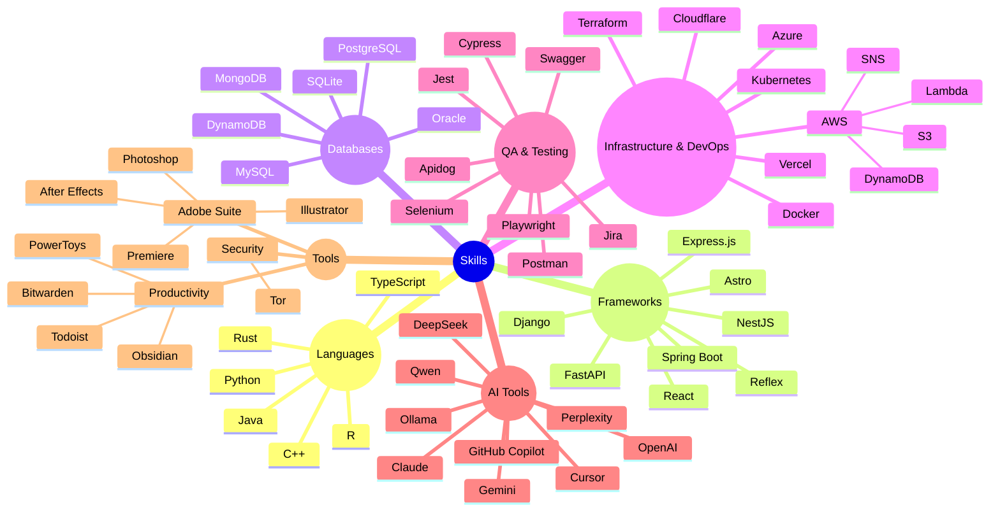

#  Hi, I'm Daniel Banariba     
### 💻 Software Engineer | Backend Developer


```python
#!/usr/bin/python
# -*- coding: utf-8 -*-


class SoftwareEngineer:

    def __init__(self):
        self.name = "Daniel Barrientos Anariba"
        self.role = "Software Engineer"
        self.language_spoken = ["es_HN", "en_US"]
        self.passions = ["Backend Development", "Clean Code", "Problem Solving"]
        self.coffee_level = 100  # Always full

    def say_hi(self):
        print("¡Hola! Thanks for dropping by - hope you find some of my work interesting.")
        print("Code with passion, debug with patience!")

    def refill_coffee(self):
        if self.coffee_level < 50:
            self.coffee_level = 100
            print("☕ Coffee refilled, ready to code again!")
        else:
            print("☕ Still have enough fuel to keep coding...")


# Always caffeinated, always coding
me = SoftwareEngineer()
me.say_hi()
```

## My Skill Set  
<table><tr><td valign="top" width="33%">

### Languages  
<div align="center">  
  
  
  
  
  
  
</div>

</td><td valign="top" width="33%">

### Frameworks  
<div align="center">  
  
  
  
  
  
  
  
</div>

</td><td valign="top" width="33%">

### Databases  
<div align="center">  
  
  
  
  
  
  
</div>

</td></tr></table>  

<table><tr><td valign="top" width="33%">

### Infrastructure & DevOps  
<div align="center">  
  
  
  
  
  
  
</div>

</td><td valign="top" width="33%">

### QA & Testing  
<div align="center">  
  
  
  
  
  
  
  
</div>

</td><td valign="top" width="33%">

### Tools  
<div align="center">  
  
  
  
  
  
  
  
  
  
</div>

</td></tr></table>  

<table><tr><td valign="top" width="100%">

### AI Tools  
<div align="center">  
  
  
  
  
  
  
  
  
  
</div>

</td></tr></table>  

### ⚡ Tech Snapshot


## 📊 GitHub Stats

<p align="center">
  
  
</p>

<!-- Featured Repositories -->
## ✨ Featured Repositories
<p align="center">
  <a href="https://github.com/danielbanariba/analizador-lexico">
    
  </a>
  <span>&nbsp;</span>
  <a href="https://github.com/danielbanariba/sistemas-de-ecuaciones">
    
  </a>
</p>
<p align="center">
  <a href="https://github.com/danielbanariba/soundclound">
    
  </a>
  <span>&nbsp;</span>
  <a href="https://github.com/danielbanariba/portafolio-dev">
    
  </a>
</p>

# 🔭Actions
<picture>
  <source media="(prefers-color-scheme: dark)" srcset="https://raw.githubusercontent.com/holic-x/holic-x/output/github-contribution-grid-snake-dark.svg">
  <source media="(prefers-color-scheme: light)" srcset="https://raw.githubusercontent.com/holic-x/holic-x/output/github-contribution-grid-snake.svg">
  
</picture>


## 📫 Contáctame:

<p>
  <a href="https://www.instagram.com/danielbanariba">
    
  </a>
  <a href="https://www.linkedin.com/in/danielbanariba">
    
  </a>
</p>

<p align="center">
  
</p>